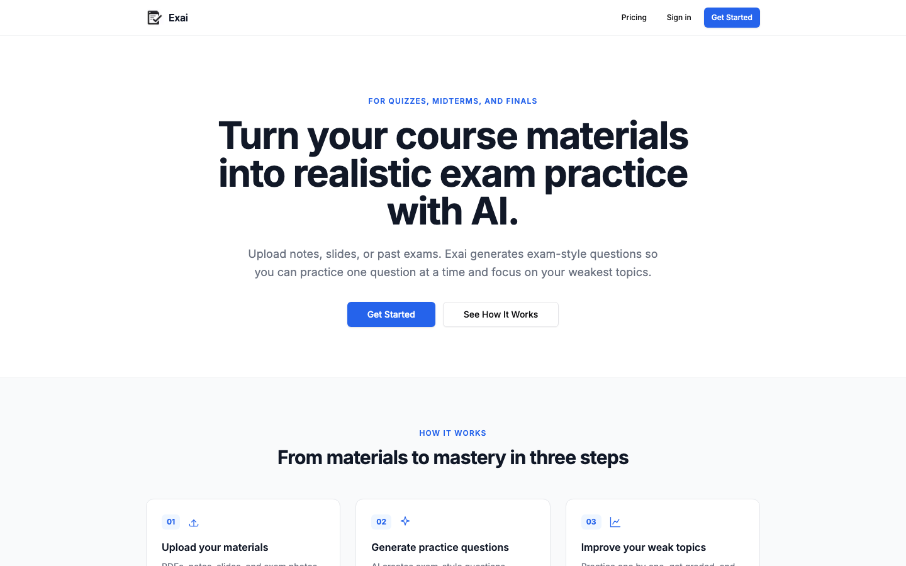
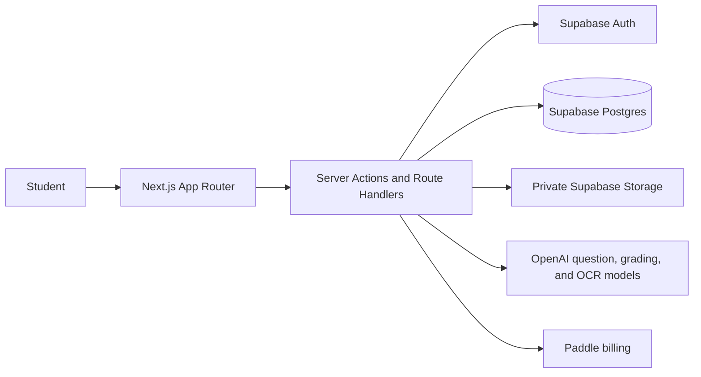

<p align="center">
  
</p>

<h1 align="center">Exai</h1>

<p align="center">
  Turn course materials and past exams into realistic, targeted exam practice.
</p>

<p align="center">
  Next.js · TypeScript · Supabase · OpenAI · Paddle
</p>

## Overview

Exai is an AI-powered study product for university students preparing for quizzes, midterms, and finals. Students upload course materials and past exams, generate original questions in the same examiner style, practice one question at a time, and focus on the topics where they need the most work.

The project was designed to make AI-assisted studying feel like a focused practice workflow rather than an open-ended chat session.

## Product



### Core workflow

1. Create a course and upload notes, slides, PDFs, past exams, or exam images.
2. Generate an exam-style question set grounded in the uploaded material.
3. Answer questions one at a time and receive structured feedback and solutions.
4. Review past attempts, question banks, and weak topics.
5. Generate targeted follow-up practice for weaker areas.

### What makes the question generation different

Exai does more than ask a model to "make similar questions." The generation pipeline:

- analyzes past exams for their structural fingerprint: language, task patterns, mark allocation, multi-part format, difficulty, notation, and expected answer depth;
- creates original structural analogues rather than paraphrases;
- balances source context across uploaded materials instead of favoring the first document;
- validates exact question counts and requested question types;
- requires source and style references on every generated question;
- rejects copied stems, duplicate questions, invalid answer choices, and malformed output before saving a set;
- uses `gpt-5.6-terra` for final generation and `gpt-5.6-luna` for style analysis, grading, and OCR, with `gpt-4.1` fallbacks.

## Architecture



## Stack

| Area | Tools |
| --- | --- |
| Product UI | Next.js 15, React 19, TypeScript, Tailwind CSS, shadcn/ui |
| Backend | Next.js Server Actions and Route Handlers |
| Data and auth | Supabase Postgres, Auth, and private Storage |
| AI | OpenAI structured outputs with Zod validation |
| Document handling | PDF parsing, DOCX extraction, PPTX extraction, vision OCR |
| Billing | Paddle |
| Deployment target | Vercel |

## Local setup

```bash
corepack pnpm install
touch .env.local
corepack pnpm dev
```

Open `http://127.0.0.1:3000`.

Populate `.env.local` with Supabase, OpenAI, and Paddle credentials. AI calls run server-side only. The repository includes incremental Supabase migrations; apply them to the connected project before deploying changes.

## Quality checks

```bash
corepack pnpm exec tsc --noEmit
corepack pnpm lint
corepack pnpm build
```

## Project status

Exai is an MVP focused on the complete study loop: account creation, course setup, private material uploads, exam-style question generation, one-at-a-time practice, AI grading, weak-topic tracking, question history, and billing.

Built by [Yusuf Berat Negiz](https://github.com/yusufberatnegiz).
